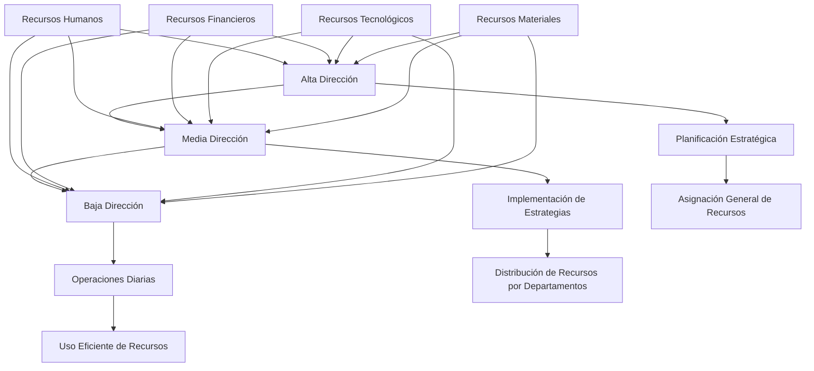

# Organizaciones como Sistemas Abiertos

## Modelo sistémico

Lourdes Münch aplica el concepto de sistemas abiertos a la administración moderna:

1. **Definición**: Las organizaciones son sistemas que interactúan constantemente con su entorno.

2. **Componentes del sistema**:
   - Entradas (inputs): recursos que la organización recibe del entorno.
   - Procesos: transformación de las entradas en salidas.
   - Salidas (outputs): productos o servicios que la organización devuelve al entorno.
   - Retroalimentación: información que el sistema recibe sobre su desempeño.

3. **Características del sistema abierto**:
   - Adaptabilidad: capacidad de ajustarse a los cambios del entorno.
   - Interdependencia: relación entre los subsistemas internos y el entorno.
   - Equifinalidad: capacidad de alcanzar los mismos objetivos por diferentes caminos.

## Características organizacionales

Münch destaca las siguientes funciones empresariales y su interacción con la sociedad:

1. **Funciones básicas**:
   - Producción
   - Marketing
   - Finanzas
   - Recursos Humanos

2. **Interacción con la sociedad**:
   - Responsabilidad social corporativa
   - Impacto ambiental
   - Generación de empleo
   - Contribución económica

3. **Adaptación al entorno**:
   - Innovación tecnológica
   - Desarrollo de nuevos productos/servicios
   - Cambios en la estructura organizacional
# Misión, Visión y Objetivos Empresariales

## Formulación de misión y visión

Münch destaca las diferencias y el impacto en la cultura corporativa:

1. **Misión**:
   - Definición: Razón de ser de la organización
   - Características:
     - Específica y concreta
     - Orientada al presente
     - Define el negocio y los clientes
   - Impacto: Guía las decisiones diarias y define la identidad de la empresa

2. **Visión**:
   - Definición: Estado futuro deseado de la organización
   - Características:
     - Inspiradora y desafiante
     - Orientada al futuro
     - Define las aspiraciones a largo plazo
   - Impacto: Motiva a los empleados y establece la dirección estratégica

## Objetivos estratégicos

Münch explica la definición y alineación de objetivos:

1. **Definición de objetivos**:
   - Corto plazo (hasta 1 año)
   - Mediano plazo (1-3 años)
   - Largo plazo (más de 3 años)

2. **Características de los objetivos SMART**:
   - Específicos (Specific)
   - Medibles (Measurable)
   - Alcanzables (Achievable)
   - Relevantes (Relevant)
   - Temporales (Time-bound)

3. **Alineación con la estrategia organizacional**:
   - Cascada de objetivos: desde la alta dirección hasta los niveles operativos
   - Coherencia entre objetivos de diferentes áreas
   - Revisión y ajuste periódico de objetivos
# Recursos Empresariales

## Tipos de recursos

Münch clasifica y explica la gestión de los siguientes recursos:

1. **Recursos Humanos**:
   - Definición: Personal de la organización
   - Gestión: Reclutamiento, selección, capacitación, desarrollo
   - Importancia: Clave para la innovación y la ventaja competitiva

2. **Recursos Financieros**:
   - Definición: Capital y activos financieros
   - Gestión: Presupuestación, inversión, control financiero
   - Importancia: Permite la operación y el crecimiento de la empresa

3. **Recursos Tecnológicos**:
   - Definición: Equipos, software, patentes
   - Gestión: Adquisición, desarrollo, mantenimiento
   - Importancia: Facilita la eficiencia y la innovación

4. **Recursos Materiales**:
   - Definición: Instalaciones, maquinaria, materias primas
   - Gestión: Adquisición, mantenimiento, optimización
   - Importancia: Necesarios para la producción de bienes y servicios

## Niveles organizacionales

Münch explica cómo los diferentes niveles gestionan los recursos:

1. **Alta Dirección**:
   - Funciones: Planificación estratégica, toma de decisiones de alto nivel
   - Gestión de recursos: Asignación general de recursos, decisiones de inversión

2. **Media Dirección**:
   - Funciones: Implementación de estrategias, coordinación entre departamentos
   - Gestión de recursos: Distribución de recursos entre proyectos y departamentos

3. **Baja Dirección**:
   - Funciones: Supervisión directa, implementación de planes operativos
   - Gestión de recursos: Uso eficiente de recursos en operaciones diarias
# Estudio de Caso: Gestión de Recursos en TechInnovate

## Contexto
TechInnovate es una empresa de tecnología que busca expandir su presencia en el mercado de inteligencia artificial (IA).

## Objetivo Estratégico
Lanzar una nueva línea de productos de IA para el hogar en los próximos 18 meses.

## Gestión de Recursos

1. **Recursos Humanos**:
   - Contratación de 5 especialistas en IA
   - Capacitación del equipo de ventas en nuevos productos

2. **Recursos Financieros**:
   - Inversión de $10 millones en I+D
   - Asignación de $5 millones para marketing

3. **Recursos Tecnológicos**:
   - Adquisición de nuevos servidores para procesamiento de datos
   - Desarrollo de software propietario de IA

4. **Recursos Materiales**:
   - Alquiler de un nuevo espacio de oficinas para el equipo de IA
   - Compra de equipos de prueba para los prototipos

## Niveles Organizacionales

1. **Alta Dirección**:
   - Aprobación del presupuesto para el proyecto
   - Establecimiento de alianzas estratégicas con proveedores

2. **Media Dirección**:
   - Coordinación entre los departamentos de I+D, producción y marketing
   - Seguimiento del progreso del proyecto

3. **Baja Dirección**:
   - Supervisión del desarrollo diario de los prototipos
   - Gestión de los equipos de trabajo en cada área

## Resultado
Gracias a la gestión efectiva de los recursos en todos los niveles, TechInnovate logró lanzar su línea de productos de IA para el hogar en 16 meses, superando las expectativas iniciales.

# Tarea: Creación de un esquema de niveles organizacionales y descripción de la interacción de recursos

Descripción de la interacción de recursos:

1. La Alta Dirección toma decisiones estratégicas sobre la asignación general de recursos, considerando todos los tipos de recursos disponibles.

2. La Media Dirección distribuye los recursos entre diferentes departamentos y proyectos, asegurando que estén alineados con los objetivos estratégicos.

3. La Baja Dirección se encarga del uso eficiente de los recursos en las operaciones diarias, supervisando directamente su utilización.

4. Los recursos fluyen de arriba hacia abajo en la organización, pero la información sobre su uso y eficiencia fluye de abajo hacia arriba, permitiendo ajustes en la estrategia y la toma de decisiones.

5. Cada nivel organizacional interactúa con todos los tipos de recursos, pero con diferentes enfoques y responsabilidades.

Este esquema y descripción muestran cómo los diferentes niveles organizacionales gestionan e interactúan con los diversos tipos de recursos para alcanzar los objetivos de la empresa.