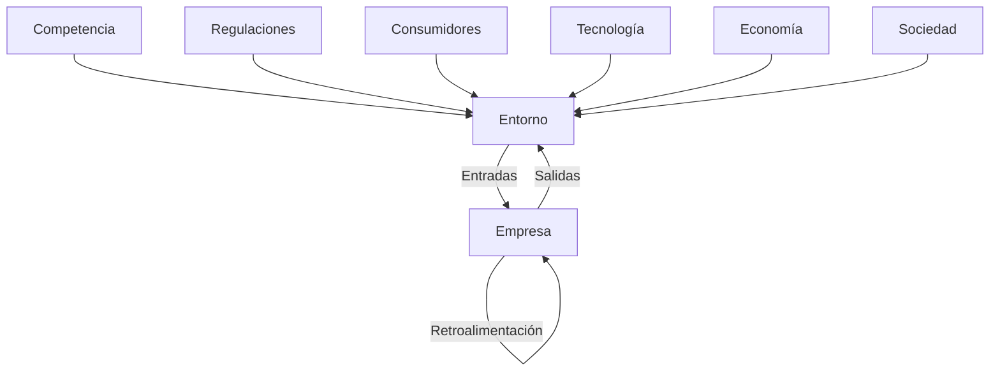
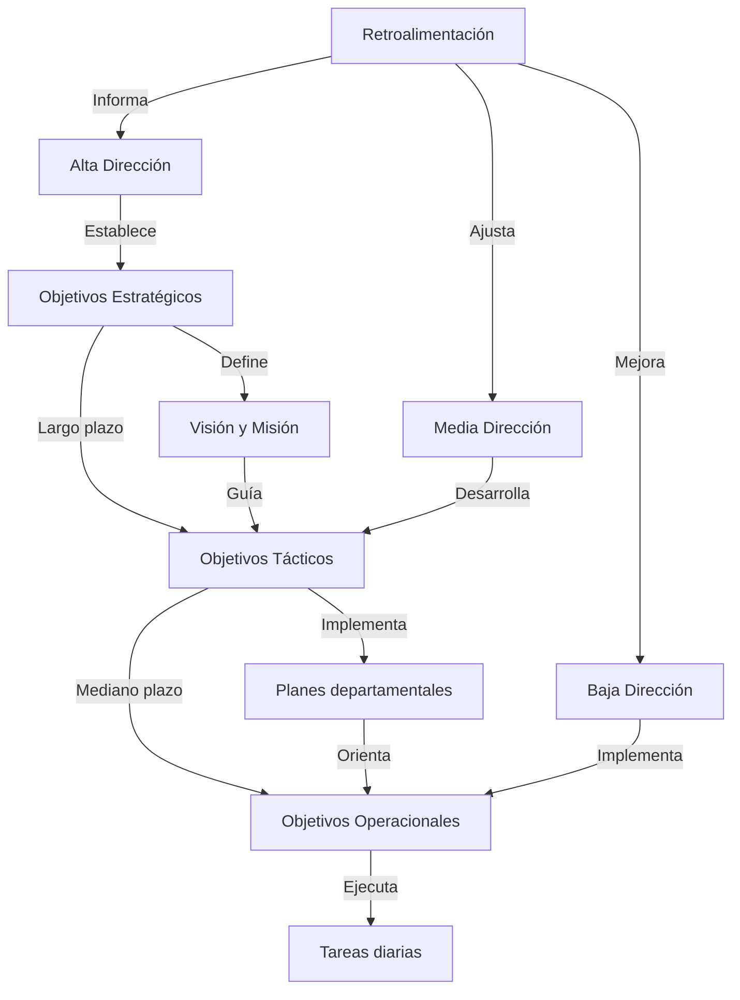

# Interacción de las Empresas con el Entorno

## Factores externos

El análisis del impacto de factores externos es crucial para la supervivencia y éxito de las empresas:

1. **Competencia**:
   - Análisis de competidores directos e indirectos
   - Estudio de estrategias competitivas en el mercado
   - Impacto: Influye en las decisiones de precios, innovación y marketing

2. **Regulaciones**:
   - Leyes y normativas gubernamentales
   - Estándares de la industria
   - Impacto: Afecta las operaciones, los costos y las estrategias de cumplimiento

3. **Comportamiento de los consumidores**:
   - Tendencias de consumo
   - Cambios en las preferencias y necesidades
   - Impacto: Determina la demanda y orienta el desarrollo de productos/servicios

## Modelo de sistema abierto

Representación gráfica de la interacción de una empresa con su entorno:

- **Entradas**: Recursos, información, demanda del mercado
- **Proceso**: Transformación de entradas en salidas
- **Salidas**: Productos, servicios, información
- **Retroalimentación**: Información sobre el desempeño y la recepción de las salidas

Este modelo ilustra cómo la empresa está en constante interacción con su entorno, recibiendo influencias y respondiendo a ellas de manera continua.
# Sistemas Mecánicos vs. Orgánicos

## Estructuras rígidas y flexibles

| Característica     | Sistema Mecánico     | Sistema Orgánico            |
| ------------------ | -------------------- | --------------------------- |
| Estructura         | Jerárquica y rígida  | Plana y flexible            |
| Comunicación       | Vertical y formal    | Horizontal y informal       |
| Toma de decisiones | Centralizada         | Descentralizada             |
| Especialización    | Alta, roles fijos    | Baja, roles adaptativos     |
| Formalización      | Alta, muchas reglas  | Baja, pocas reglas formales |
| Adaptabilidad      | Baja                 | Alta                        |
| Entorno ideal      | Estable y predecible | Dinámico e incierto         |

## Implicaciones en la toma de decisiones

1. **Sistema Mecánico**:
   - Decisiones centralizadas en la alta dirección
   - Procesos de decisión más lentos pero consistentes
   - Menor flexibilidad para responder a cambios rápidos
   - Ideal para entornos estables y tareas rutinarias

2. **Sistema Orgánico**:
   - Decisiones distribuidas en diferentes niveles
   - Procesos de decisión más rápidos y adaptables
   - Mayor flexibilidad para responder a cambios del entorno
   - Ideal para entornos dinámicos y tareas innovadoras

La elección entre un sistema mecánico u orgánico afecta significativamente la capacidad de la empresa para adaptarse a su entorno y responder a los desafíos del mercado.
# Objetivos en los Niveles Organizacionales

## Explicación de la alineación de objetivos:

1. **Objetivos Estratégicos** (Largo plazo):
   - Establecidos por la alta dirección
   - Definen la dirección general de la organización
   - Ejemplos: Expandir a nuevos mercados, aumentar la cuota de mercado

2. **Objetivos Tácticos** (Mediano plazo):
   - Desarrollados por la media dirección
   - Implementan los objetivos estratégicos a nivel departamental
   - Ejemplos: Lanzar nuevos productos, mejorar la eficiencia operativa

3. **Objetivos Operacionales** (Corto plazo):
   - Implementados por la baja dirección
   - Se traducen en tareas y metas diarias
   - Ejemplos: Aumentar la producción diaria, reducir el tiempo de respuesta al cliente

La alineación efectiva asegura que cada nivel contribuya al logro de los objetivos generales de la organización, creando una cascada de metas coherentes desde la estrategia hasta las operaciones diarias.
# Caso Práctico: Google como Sistema Abierto

## 1. Entradas
- **Recursos humanos**: Talento global en tecnología e innovación
- **Recursos financieros**: Ingresos por publicidad y servicios en la nube
- **Información**: Datos de usuarios, tendencias de búsqueda, avances tecnológicos
- **Tecnología**: Avances en IA, computación en la nube, hardware

## 2. Proceso de transformación
- Desarrollo de algoritmos de búsqueda
- Innovación en productos y servicios (Gmail, Google Maps, Android)
- Análisis de datos para mejorar la publicidad dirigida
- Investigación en tecnologías emergentes (IA, vehículos autónomos)

## 3. Salidas
- Servicios de búsqueda y publicidad en línea
- Productos de software (Sistema operativo Android, Google Workspace)
- Innovaciones tecnológicas (Google AI, Waymo)
- Información y conocimiento para usuarios y anunciantes

## 4. Retroalimentación
- Datos de uso de productos y servicios
- Opiniones de usuarios y críticas de la industria
- Métricas de rendimiento y participación de mercado

## 5. Interacción con el entorno

### Competencia
- Rivalidad con empresas tecnológicas (Apple, Microsoft, Facebook)
- Adaptación a nuevas formas de búsqueda y publicidad

### Regulaciones
- Enfrentamiento a leyes antimonopolio y de privacidad de datos
- Adaptación a regulaciones globales (GDPR en Europa)

### Comportamiento de los consumidores
- Respuesta a la creciente preocupación por la privacidad
- Adaptación a la demanda de servicios móviles y en la nube

### Tecnología
- Inversión en IA, computación cuántica y otras tecnologías emergentes
- Adquisición de startups innovadoras

Este análisis muestra cómo Google, como sistema abierto, interactúa constantemente con su entorno, adaptándose a los cambios y desafíos para mantener su posición de liderazgo en el mercado tecnológico.

# Retroalimentación: Revisión comparativa de las tareas anteriores

Para esta retroalimentación, revisaré los conceptos clave cubiertos en los días 1, 2 y 3, destacando cómo se interrelacionan:

1. **Concepto de Administración** (Día 1):
   - La definición de administración como proceso sistemático se relaciona directamente con el modelo de sistema abierto (Día 3).
   - La evolución hacia enfoques modernos refleja la necesidad de estructuras más orgánicas en entornos dinámicos (Día 3).

2. **Organizaciones como Sistemas Abiertos** (Día 2):
   - Este concepto se amplía en el Día 3 con el análisis detallado de la interacción empresa-entorno.
   - La adaptabilidad mencionada en el Día 2 se relaciona con la elección entre sistemas mecánicos y orgánicos (Día 3).

3. **Misión, Visión y Objetivos** (Día 2):
   - La alineación de objetivos (Día 3) muestra cómo la misión y visión se traducen en objetivos concretos en diferentes niveles organizacionales.

4. **Recursos Empresariales** (Día 2):
   - La gestión de recursos se refleja en las "entradas" del modelo de sistema abierto (Día 3).
   - La forma en que se gestionan los recursos varía entre sistemas mecánicos y orgánicos (Día 3).

5. **Niveles Organizacionales** (Día 2 y 3):
   - La estructura de niveles se relaciona con la elección entre sistemas mecánicos y orgánicos (Día 3).
   - La alineación de objetivos (Día 3) muestra cómo cada nivel contribuye a los objetivos generales de la organización.

Esta revisión muestra cómo los conceptos se construyen y se interrelacionan a lo largo de los tres días, proporcionando una comprensión integral de las organizaciones como sistemas dinámicos que interactúan con su entorno.