# 1. El Ambiente Empresarial

## Factores externos

### Factores económicos
- Tasas de interés
- Inflación
- Crecimiento económico
- Tipos de cambio

### Factores políticos
- Estabilidad política
- Políticas comerciales
- Regulaciones laborales
- Políticas fiscales

### Factores tecnológicos
- Innovaciones disruptivas
- Automatización
- Transformación digital
- Ciberseguridad

### Factores sociales
- Cambios demográficos
- Tendencias de consumo
- Valores culturales
- Responsabilidad social corporativa

## Adaptación organizacional

### Casos de éxito
- Netflix: Transición de alquiler de DVD a streaming
- IBM: Cambio de hardware a servicios y cloud computing

### Casos de fracaso
- Kodak: Falta de adaptación a la fotografía digital
- Blockbuster: Incapacidad para competir con servicios de streaming

# 2. Ambiente de Tarea

## Sectores de influencia

### Proveedores
- Poder de negociación
- Dependencia de recursos críticos
- Integración vertical

### Competidores
- Intensidad de la competencia
- Barreras de entrada
- Productos sustitutos

### Regulaciones
- Normativas sectoriales
- Estándares de calidad
- Leyes antimonopolio

## Factores regulatorios

- Impacto en costos operativos
- Cumplimiento normativo
- Oportunidades y limitaciones para la innovación
- Efecto en la estructura del mercado

# 3. Adaptación al Entorno

## Estudios de caso

### Adaptaciones exitosas
- Amazon: Expansión de e-commerce a servicios en la nube (AWS)
- Toyota: Adopción temprana de tecnologías híbridas

### Fracasos empresariales
- Nokia: Pérdida de liderazgo en el mercado de smartphones
- Toys "R" Us: Incapacidad para competir con el comercio electrónico
# Refuerzo

## Ejercicio práctico: Crear un mapa ambiental de una empresa simulada

Para este ejercicio, crearemos un mapa ambiental para una empresa simulada llamada "EcoTech Solutions", una compañía de tecnología verde que desarrolla soluciones de energía renovable para hogares y pequeñas empresas.

```mermaid
graph TD
    A[EcoTech Solutions] --> B[Factores Económicos]
    A --> C[Factores Políticos]
    A --> D[Factores Tecnológicos]
    A --> E[Factores Sociales]
    A --> F[Ambiente de Tarea]
    
    B --> B1[Crecimiento económico]
    B --> B2[Tasas de interés]
    B --> B3[Subsidios energéticos]
    
    C --> C1[Políticas de energía limpia]
    C --> C2[Regulaciones ambientales]
    C --> C3[Incentivos fiscales]
    
    D --> D1[Avances en energía solar]
    D --> D2[Tecnología de baterías]
    D --> D3[IoT para gestión energética]
    
    E --> E1[Conciencia ambiental]
    E --> E2[Tendencias de consumo sostenible]
    E --> E3[Movimientos de ciudades inteligentes]
    
    F --> F1[Proveedores]
    F --> F2[Competidores]
    F --> F3[Reguladores]
    
    F1 --> F1a[Fabricantes de paneles solares]
    F1 --> F1b[Proveedores de componentes electrónicos]
    
    F2 --> F2a[Grandes empresas energéticas]
    F2 --> F2b[Startups de energía renovable]
    
    F3 --> F3a[Agencias de energía]
    F3 --> F3b[Organismos de certificación]

```

Este mapa ambiental muestra las diversas influencias externas que afectan a EcoTech Solutions, incluyendo factores económicos, políticos, tecnológicos y sociales, así como los elementos del ambiente de tarea.
# Informe: Sectores que Influyen en la Industria de Energía Renovable

## 1. Sector de Proveedores

### Fabricantes de Componentes
- Paneles solares
- Turbinas eólicas
- Baterías de almacenamiento

**Impacto**: La innovación y los precios en estos componentes afectan directamente la competitividad de EcoTech Solutions.

### Proveedores de Materias Primas
- Silicio para paneles solares
- Metales raros para baterías

**Impacto**: La disponibilidad y el costo de estas materias primas influyen en la cadena de suministro y los costos de producción.

## 2. Sector de Competidores

### Grandes Empresas Energéticas
- Empresas tradicionales que se diversifican hacia energías renovables

**Impacto**: Aumentan la competencia pero también pueden ser potenciales socios o clientes para soluciones B2B.

### Startups de Tecnología Verde
- Empresas emergentes con soluciones innovadoras

**Impacto**: Impulsan la innovación en el sector y pueden representar amenazas disruptivas o oportunidades de colaboración.

## 3. Sector Regulatorio

### Agencias Gubernamentales de Energía
- Establecen políticas y estándares energéticos

**Impacto**: Las regulaciones pueden crear oportunidades (incentivos) o desafíos (requisitos estrictos) para EcoTech Solutions.

### Organismos de Certificación
- Otorgan certificaciones de eficiencia y seguridad

**Impacto**: Las certificaciones son cruciales para la credibilidad y la entrada a ciertos mercados.

## 4. Sector Financiero

### Inversores de Capital de Riesgo
- Financian startups y proyectos innovadores

**Impacto**: Fuente importante de capital para la expansión y el desarrollo de nuevas tecnologías.

### Instituciones Financieras Verdes
- Bancos y fondos especializados en proyectos sostenibles

**Impacto**: Ofrecen financiamiento específico para proyectos de energía renovable, afectando la viabilidad de grandes iniciativas.

## Conclusión
La industria de energía renovable está fuertemente influenciada por una variedad de sectores interconectados. Para EcoTech Solutions, navegar exitosamente en este entorno requiere una comprensión profunda de estas influencias y la capacidad de adaptarse rápidamente a los cambios en cada sector.