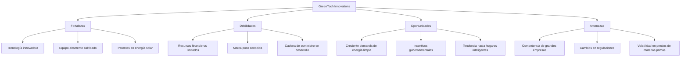

# 1. Funciones Clásicas de la Administración

## Planeación
- Definición de objetivos y metas
- Desarrollo de estrategias y tácticas
- Asignación de recursos

## Organización
- Diseño de la estructura organizacional
- Asignación de roles y responsabilidades
- Coordinación de actividades

## Dirección
- Liderazgo y motivación
- Comunicación efectiva
- Toma de decisiones

## Control
- Establecimiento de estándares
- Medición del desempeño
- Acciones correctivas

## Interrelación entre las funciones
- La planeación guía la organización y la dirección
- La organización facilita la implementación de planes
- La dirección asegura la ejecución efectiva
- El control retroalimenta a la planeación para ajustes

# 2. Planeación Estratégica

## Análisis FODA

### Fortalezas
- Capacidades internas
- Recursos únicos
- Ventajas competitivas

#### Oportunidades
- Tendencias del mercado favorables
- Cambios tecnológicos
- Necesidades no satisfechas de los clientes

#### Debilidades
- Limitaciones internas
- Falta de recursos o capacidades
- Desventajas competitivas

#### Amenazas
- Competencia agresiva
- Cambios regulatorios
- Cambios en las preferencias del consumidor

### Formulación estratégica

1. Definición de la misión y visión
2. Establecimiento de objetivos a largo plazo
3. Análisis del entorno externo e interno
4. Identificación de opciones estratégicas
5. Selección de la estrategia
6. Implementación de la estrategia
7. Evaluación y control

## 3. Formulación de Alternativas Estratégicas

### Tipos de estrategias
- Estrategias de crecimiento (integración, diversificación)
- Estrategias de estabilidad
- Estrategias de reducción

### Evaluación de estrategias
- Consistencia con la misión y objetivos
- Factibilidad de implementación
- Impacto potencial en el desempeño
- Alineación con el entorno y recursos

### Selección de estrategias
- Uso de matrices de evaluación
- Consideración de riesgos y beneficios
- Consenso entre los tomadores de decisiones

Ahora, procederé con los refuerzos mencionados:

### Refuerzo

#### Ejercicio práctico: Desarrollo de una planeación estratégica para una empresa simulada

Para este ejercicio, desarrollaremos una planeación estratégica para "GreenTech Innovations", una startup de tecnología que se especializa en soluciones de energía renovable para hogares inteligentes.

1. Análisis FODA de GreenTech Innovations:

2. Formulación Estratégica para GreenTech Innovations:

# Formulación Estratégica de GreenTech Innovations

## Misión
Proporcionar soluciones de energía renovable innovadoras y accesibles para hogares inteligentes, contribuyendo a un futuro sostenible.

## Visión
Ser líderes globales en tecnología de energía limpia para hogares inteligentes, revolucionando la forma en que las personas interactúan con la energía en sus hogares.

## Objetivos a Largo Plazo
1. Alcanzar una participación del 15% en el mercado de soluciones de energía renovable para hogares en 5 años.
2. Desarrollar y patentar 3 nuevas tecnologías de energía limpia en los próximos 3 años.
3. Expandir operaciones a 5 países en los próximos 5 años.

## Estrategias Seleccionadas

### 1. Estrategia de Diferenciación Tecnológica
- Invertir el 20% de los ingresos en I+D para mantener la ventaja tecnológica.
- Colaborar con universidades y centros de investigación para el desarrollo de nuevas tecnologías.

### 2. Estrategia de Penetración de Mercado
- Desarrollar una fuerte campaña de marketing digital para aumentar el reconocimiento de marca.
- Establecer alianzas estratégicas con constructoras de hogares inteligentes.

### 3. Estrategia de Desarrollo de Producto
- Lanzar una nueva línea de productos de almacenamiento de energía para complementar las soluciones solares existentes.
- Desarrollar una plataforma IoT para la gestión eficiente de energía en hogares.

### 4. Estrategia de Sostenibilidad Financiera
- Buscar financiamiento a través de inversores de capital de riesgo especializados en tecnología verde.
- Implementar un modelo de negocio de suscripción para generar ingresos recurrentes.

## Plan de Implementación
1. Q1-Q2: Lanzamiento de la campaña de marketing y búsqueda de financiamiento.
2. Q3-Q4: Desarrollo de la nueva línea de productos de almacenamiento de energía.
3. Año 2: Expansión a dos nuevos mercados internacionales.
4. Año 3: Lanzamiento de la plataforma IoT para gestión de energía.

## Métricas de Evaluación
- Crecimiento en ventas y participación de mercado
- Número de nuevas patentes registradas
- Retorno de la inversión en I+D
- Nivel de satisfacción del cliente
- Eficiencia energética lograda en hogares equipados con nuestras soluciones
#### Retroalimentación: Discusión sobre estrategias aplicadas en empresas reales

Para esta parte, analizaremos brevemente las estrategias de dos empresas reales en el sector de energía renovable y tecnología verde:

1. Tesla, Inc.

Tesla ha implementado una estrategia de integración vertical y diferenciación de producto. Algunos puntos clave de su estrategia incluyen:

- Desarrollo de tecnología de baterías avanzadas
- Expansión más allá de los vehículos eléctricos hacia la energía solar y el almacenamiento de energía
- Creación de una marca fuerte asociada con innovación y sostenibilidad
- Inversión continua en I+D para mantener la ventaja tecnológica

2. Ørsted (anteriormente DONG Energy)

Ørsted ha llevado a cabo una transformación estratégica significativa:

- Transición de una compañía de combustibles fósiles a un líder en energía renovable, especialmente en energía eólica marina
- Desinversión en activos de petróleo y gas
- Inversión masiva en proyectos de energía renovable a gran escala
- Expansión global en mercados clave de energía renovable

Discusión:
- ¿Qué similitudes y diferencias observas entre las estrategias de estas empresas y las propuestas para GreenTech Innovations?
- ¿Cómo han adaptado estas empresas sus estrategias en respuesta a los cambios en el entorno empresarial y tecnológico?
- ¿Qué lecciones podría aprender GreenTech Innovations de estas empresas establecidas?