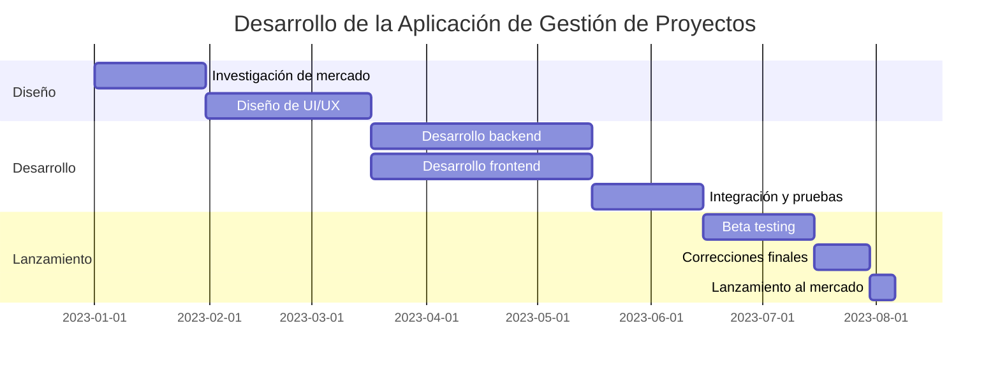
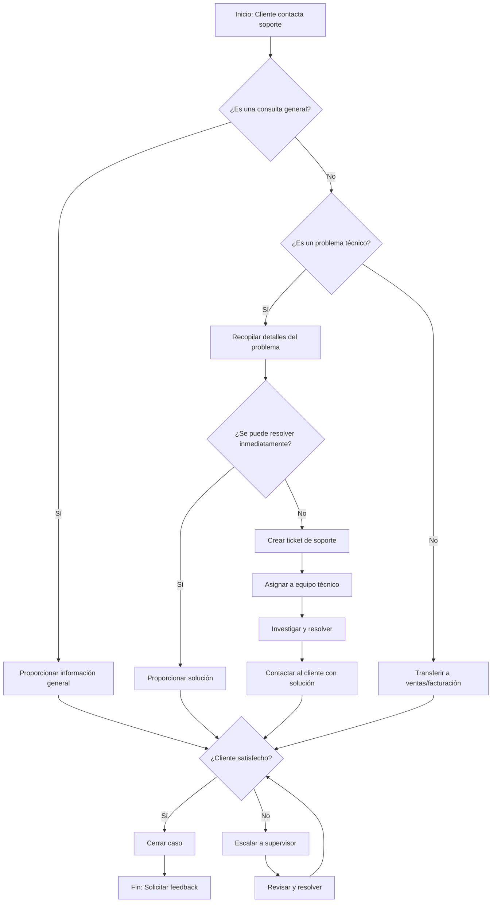

## 1. Planeación Táctica

### Proceso de toma de decisiones

1. **Identificación del problema**
   - Reconocimiento de la situación
   - Definición clara del problema

2. **Análisis de alternativas**
   - Recopilación de información relevante
   - Generación de posibles soluciones
   - Evaluación de pros y contras de cada alternativa

3. **Selección de la mejor opción**
   - Criterios de selección (costo, tiempo, impacto, etc.)
   - Uso de técnicas de decisión (análisis costo-beneficio, árbol de decisiones, etc.)
   - Implementación y seguimiento de la decisión

### Niveles de decisión

1. **Decisiones estratégicas**
   - Largo plazo (3-5 años o más)
   - Afectan a toda la organización
   - Tomadas por la alta dirección
   - Ejemplo: Entrar en un nuevo mercado

2. **Decisiones tácticas**
   - Mediano plazo (1-3 años)
   - Afectan a departamentos o unidades de negocio
   - Tomadas por mandos medios
   - Ejemplo: Lanzamiento de una nueva línea de productos

3. **Decisiones operacionales**
   - Corto plazo (diarias, semanales, mensuales)
   - Afectan a operaciones específicas
   - Tomadas por supervisores o empleados de primera línea
   - Ejemplo: Programación de la producción diaria

## 2. Planeación Operacional

### Planes operativos

1. **Diagramas de flujo**
   - Representación gráfica de procesos
   - Identificación de pasos, decisiones y flujos de información
   - Útil para optimizar y estandarizar procesos

2. **Diagramas de Gantt**
   - Visualización de cronogramas de proyectos
   - Muestra tareas, duraciones y dependencias
   - Facilita la gestión de recursos y tiempos

### Planes de contingencia

1. **Identificación de riesgos potenciales**
   - Análisis de vulnerabilidades
   - Evaluación de impacto y probabilidad

2. **Desarrollo de estrategias de mitigación**
   - Acciones preventivas
   - Procedimientos de respuesta rápida

3. **Implementación y prueba**
   - Simulacros y ejercicios de crisis
   - Actualización regular de planes

## 3. Decisiones Programables vs. No Programables

### Decisiones programables
- Rutinarias y repetitivas
- Pueden ser estandarizadas
- Se basan en políticas y procedimientos establecidos
- Ejemplo: Reordenar inventario cuando alcanza cierto nivel

### Decisiones no programables
- Únicas o poco frecuentes
- Requieren análisis caso por caso
- Involucran mayor incertidumbre y riesgo
- Ejemplo: Responder a una nueva tecnología disruptiva en el mercado

### Aplicación
- Las organizaciones deben equilibrar ambos tipos de decisiones
- Automatizar decisiones programables para eficiencia
- Desarrollar habilidades de pensamiento crítico para decisiones no programables

Ahora, procederé con los refuerzos mencionados:

### Refuerzo

#### Caso práctico: Aplicación de la planeación táctica y operacional en un escenario empresarial

Escenario: "TechGrow", una empresa de software que desarrolla aplicaciones de productividad, ha decidido lanzar una nueva aplicación de gestión de proyectos para equipos remotos.

1. Planeación Táctica:

a) Proceso de toma de decisiones:
- Identificación del problema: Necesidad de diversificar la cartera de productos y abordar el creciente mercado de trabajo remoto.
- Análisis de alternativas: 
  1. Desarrollar una nueva aplicación internamente
  2. Adquirir una startup con una solución existente
  3. Asociarse con otra empresa para co-desarrollar la aplicación
- Selección: Se decide desarrollar internamente para mantener el control sobre la propiedad intelectual y alinearse con la cultura de innovación de la empresa.

b) Nivel de decisión: Táctica, ya que afecta a un departamento específico (desarrollo de productos) y tiene un horizonte de tiempo de 1-2 años.

2. Planeación Operacional:

a) Plan operativo para el desarrollo de la aplicación:

b) Plan de contingencia:
- Riesgo identificado: Retraso en el desarrollo debido a problemas técnicos imprevistos.
- Estrategia de mitigación: 
  1. Mantener un equipo de desarrolladores de reserva.
  2. Establecer hitos intermedios para identificar retrasos tempranamente.
  3. Preparar un plan de comunicación para informar a los stakeholders sobre posibles retrasos.

3. Decisiones Programables vs. No Programables:

- Decisión programable: Asignación diaria de tareas al equipo de desarrollo basada en la metodología Scrum.
- Decisión no programable: Respuesta a un competidor que lanza una aplicación similar antes del lanzamiento planificado de TechGrow.

#### Tarea: Desarrollar un diagrama de flujo para un proceso operativo

Tarea: Desarrollar un diagrama de flujo para el proceso de atención al cliente para la nueva aplicación de gestión de proyectos de TechGrow.

Este diagrama de flujo muestra el proceso de atención al cliente desde el momento en que se recibe una consulta hasta su resolución, incluyendo diferentes rutas según el tipo de problema y la complejidad de la solución.